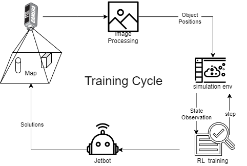

# Intro
This is a simulation repo for Capstone Project "Robotics at home"

# Tools 

Use Mujoco to build a simulation environment for Jetbot 

# References

## 1. mjcf

for xml file generation

## 2. gym
an open-sourced simulation environment 

# Works
1. jetbot modeling: a simple model of jetbot has been added as shown in bot_env_v1.xml
2. A diagram of the whole process. 
3. Jetbot class created
   * front, left, right movement function can now work 
   * back function is not working 
4. Controller class created for keyboard control 
