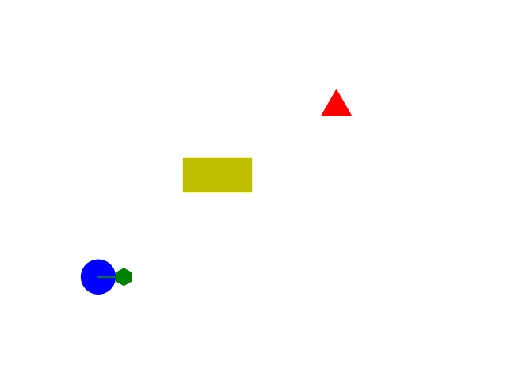

# virtual2D: 
* A simple environment using Matplotlib

* It can wait for command sent to cmd.txt file. 
* I can cooperate with video-real file in Capstone-Integration repository. To do so, you might need a second screen, run virtual2D on the first screen and video-real on the second screen. 

# cmd_operate: 
* operate cmd.txt file to write/ read/ send command. 
* to run socket client on the Jetbot, you need to check jetbotController repository.

# gym_rev folder(not recommended):
* Repo for 3D rendering using gym.MuJoCo. 
* Directly used the resouce code and deleted many unused files
* However, it is still needed to register for MuJoCo 
* Ideally, it can be the same using _pip install -e_ as the tuturial notes 
  
## An 'inaccurate' simulation env for jetbot 
* With 3D rendering, the Mojoco_jetbot can move forward, left, right 
* Similar command as Jetbot, even less accurate
* Hopefully, after tested feasible here, the real world jetbot can act as we want.

## run MotionRender 
* A 3D render for Jetbot 
* The render can read cmd.txt to decide the motion of Jetbot according to it.